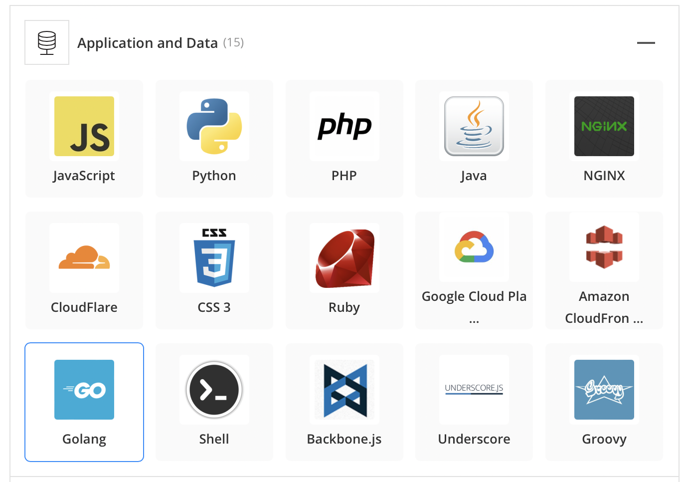

# HomeWork-1-

# Betterment - Creating Wealth 

## Origin of Betterment 

This company was incorporated in 2008 and was founded by Jon Stein and Eli Broverman. 
The idea came about when Stein and his university roommate started building the initial platform. Stein was assisted by various people along the way but sort out to make Broverman his co-founder when he started facing more financial regulations surrounding setting up the company. Betterment went through 10 rounds of funding through various series, venture and debt financing for a total of $435M.

## Betterment in Business 
---

The company focuses on assisting their clientele manage their funds by choosing portfolios that match their goals in a timely and cost-effective manner.

Their customer base varies from the young (18years and above) to the old. It caters to all and can be especially appealing to those who are not interested in the concept of learning more about securities. It ensures that if you do not want to partake in the daily affairs of your portfolio, you do not have to.
Betterment, per their website claims a customer base of over 730,000 users.
Betterment offers the robo-adviser services. It targets various investors particularly new investors who are looking for comprehensive low-cost investment management or older who are looking for continuous rebalance and like goal-oriented tools. In addition to this betterment offers a premium service that can provide clients with financial advisors.
One of Betterments major competitors ‘Wealthsimple’ offered similar services however, the robo-advice system offered by Betterment simply made a lot of its processes very streamlined which makes it easier to charge a lower management fee compared to its competitor.

Some of the technologies used by Betterment are shown below: 

## Landscape:
---

Betterment belongs to the wealth management aspect of the financial industry who uses the Robo-advisers as one of its major outputs to service its clientele.

The past two years made digitising systems a necessity and in doing so, getting the digital aspect right has boosted the client engagement and servicing strategy. There are continuous adaption and dialogue between the client and advisor on better user-friendly experience.
The use of cloud computing has also provided more security for wealth managers to safeguard information whilst also providing better compliance for regulation purposes.

Some of the major companies in this domain includes: Acorns, M1 Finance, Wealthsimple, Charles Schwab, Vanguard.

## Results:
---

Betterment has been positive in its business activities. It has been able to keep its spot as one of the leading Tech advisory firms after causing disruptions in the market since 2010. These disruptions have also made the larger investment firms to take action into the technology of robo-advice and scale to accommodate this process into their own systems. This has brought about a wider access of people being able to tap into larger investment firms strategies as compared to when it was mostly scaled to high net worth individuals.
One of the core metric for measuring success in this domain is the AUM - Asset Under Management and according to Betterments website they currently manage about $33Billion of assets and based on the industry performance this is one of the top performing companies.

Relative to it's competitors, Betterment compares its portfolio to those professionally managed and claims it has generated an annual return of 7.3% since 2004 if invested. However, Betterment metric for performance has to do with the AUM as it services quite a number of people and manages about $33Billion USD which is known to be one of the largest in its domain.

## Recommendations:
---
Betterment, by incorporating more investment options and diversifying internationally, this is something a premium client might find a bit more appealing to increase growth in the company. However, this may cause their management cost to rise.

Marketing might be one of the biggest factors to deal with when it comes to growth as these companies initially pull customers through word-of-mouth but now, with the bigger investment companies starting to come into play with similar services. It has become a harder battle to stay on top for other startups. Getting the brand out and finding new clients and also achieving scale is a difficult aspect for the robo-advisers for example Vanguard coming into the industry has taken over $200billion in its digital platform. 

Robo-advisers are here to stay but building scale might mean finding market niche that the bigger investments companies are not willing to tap into just yet such as cryptocurrency. The wave within the crypto field is rising steadily. There have been indications that the company has now jumped on this wave to acquire their own market share of this.

These products and services will add portfolio diversification and attract more users, especially high net worth individuals who derive greater diversity and more portfolio options which will essentially drives the growth of the business.
Also, growing the marketing service of the business to reach a wider demographic as taking customers from the already established investment companies would be a difficult process due to already established trust process between clients and advisors.
The crypto product is an emerging market which keeps expanding and growing, tapping into this would also provide Betterment with access to a wider range of clients. 

Some added technologies that Betterment could implement include: Smart contracts and blockchain technology. In the aspect of products, betterment has started to secure their entry into the cryptocurrency field with the acquisition of Makara who also provides robo crypto advice. 

These technologies are approporate as they offer wealth managers the ability to create a more secure and transparent process at a reduced cost with the use of blockchain technology which can provide secure and unaltered data.

The usage of smart contracts can make clients aware of changes made to their portfolios which provides the utmost level of transparency in real time and also saving the company time. With betterment, this may be more suited for their premium clients who may be more interested in the loop of what is going on with their portfolio.

## Sources:
---

https://www.crunchbase.com/organization/betterment/company_financials

https://seeklogo.com/vector-logo/424888/betterment

https://www.investopedia.com/betterment-enters-crypto-with-makara-acquisition-5218550 

https://www.betterment.com

https://www.creditdonkey.com/betterment-returns.html#returns

https://research.aimultiple.com/digital-transformation-wealth-management/

https://stackshare.io/betterment/betterment

https://www.insiderintelligence.com/insights/investing-and-wealth-management-providers/

https://www.cnbc.com/2022/01/27/roboadvisor-disruption-of-wall-street-wealth-is-not-working-out.html

